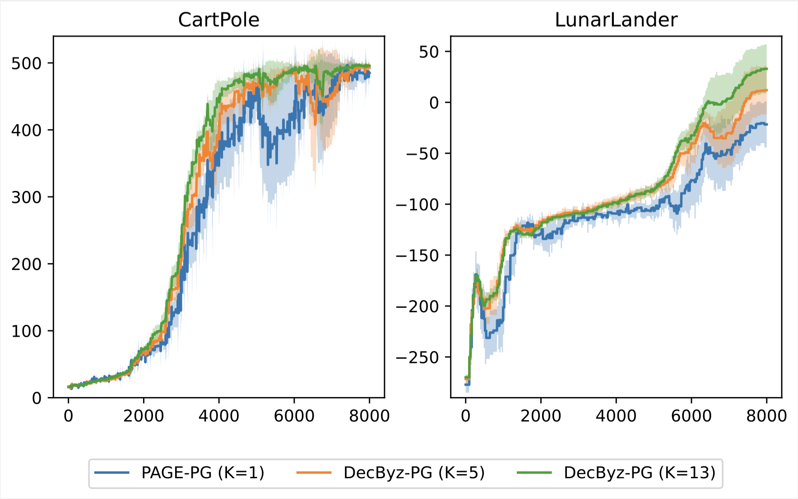
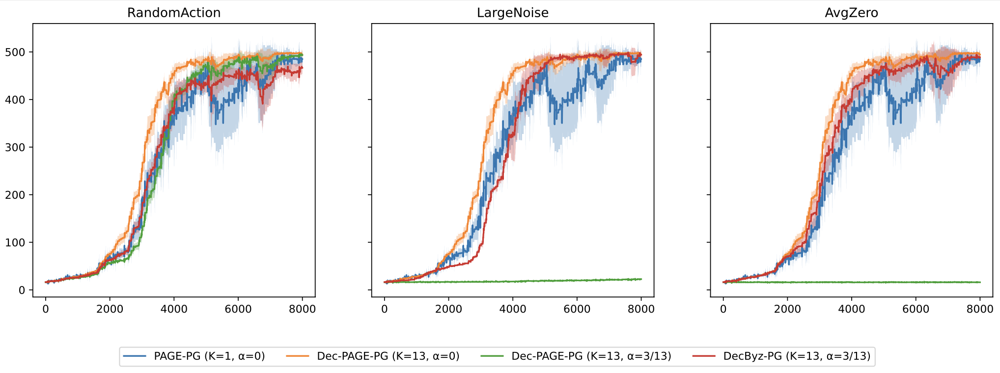
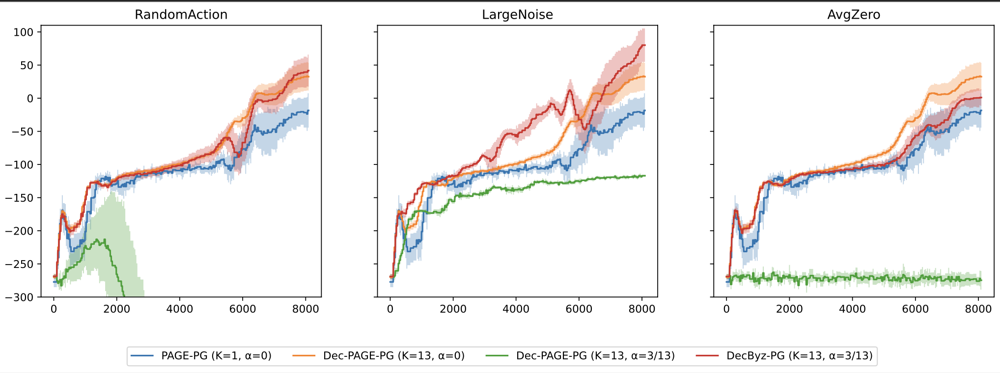

# Decentralized Federated Policy Gradient with Byzantine Fault-Tolerance and Provably Fast Convergence

This repository contains the code for reproducing the experimental results and simulations as presented in the paper:

> Philip Jordan, Florian Grötschla, Flint Xiaofeng Fan and Roger Wattenhofer. "[Decentralized Federated Policy Gradient with Byzantine Fault-Tolerance and Provably Fast Convergence](https://arxiv.org/abs/2401.03489)." 2024.

## Table of Contents
   * [TLDR](#tldr)
   * [Methods](#methods)
     - [*Centralized* Byzantine-Tolerant Federated Policy Gradient](#centralized-byzantine-tolerant-federated-policy-gradient)
     - [*Decentralized* Byzantine-Tolerant Federated Policy Gradient](#decentralized-byzantine-tolerant-federated-policy-gradient)
   * [Experiments](#experiments)
     - [Setup and Run Instructions](#setup-and-run-instructions)
     - [Plots](#plots)
   * [Cite](#cite)
   * [References](#references)

---

## TLDR

Our paper introduces a decentralized Byzantine fault-tolerant federated reinforcement learning method: Each agent is acting in its local environment, and, without exchanging raw trajectories (but only policies and policy gradients), agents aim to collaboratively learn a common task. The merit of our method is in its provable convergence (and competitive sample complexity bounds) despite a fraction of agents sending Byzantine updates, and without relying on a central trusted server.

## Methods
### *Centralized* Byzantine-Tolerant Federated Policy Gradient

`ByzPG`, the first method presented in our paper, serves as a warm-up for combining Byzantine filtering/aggregation in the context of variance-reduced policy gradient.

### *Decentralized* Byzantine-Tolerant Federated Policy Gradient

The `DecByzPG` algorithm, our main contribution, is a decentralized variant of `ByzPG`. It combines the aggregation methods from `ByzPG` with a decentralized communication and agreement protocol that enables Byzantine fault-tolerance despite the lack of a central trusted entity. For details of our algorithm, we refer to the paper.

## Experiments

Our experiments aim to demonstrate
1. speed-up when increasing the number of agents, and
2. resilience against various Byzantine attacks.

We apply our algorithms to the `CartPole-v1` and `LunarLander-v2` environments from the [OpenAI Gym](https://gymnasium.farama.org) toolkit.

### Setup and Run Instructions

The setup has been tested for `Python 3.8.16`. To install the necessary dependencies, run
```
pip install -r requirements.txt
```
Then, running `run_experiments.sh` reproduces all experiments contained in the paper with the same choice of seeds. As described in the paper, running a single experiment terminates within few hours on a consumer-grade CPU. Running all experiments sequentially however might take a long time. We therefore recommend running as many experiments as possible in parallel on a cluster.

Note that the results of the experiments will be stored in an `experiments` directory. Each experiment will be associated with a unique ID obtained from the set of chosen hyperparameters. Results (in form of the history of obtained rewards during training) of an experiment with ID `x` and seed `i` can be found in `experiments/x/seed_i/rew_hist.npy`, and the respective choice of parameters is contained in `experiments/x/config.json`.

### Plots

Below, `K` denotes the number of agents in the system among which an `𝛼`-fraction is Byzantine.

### `DecByzPG` without Byzantine Agents


Speed-up with increasing number of agents in both in both `CartPole` and `LunarLander`, as suggested by our theoretical sample complexity results.

### `DecByzPG` under Attack (CartPole)


Comparing `DecByzPG` for `CartPole` under above attacks to (a) [`PAGE-PG`](https://proceedings.mlr.press/v162/gargiani22a/gargiani22a.pdf), the SOTA (in terms of sample complexity) single-agent PG method that `DecByzPG` reduces to for `K=1`, and (b) `Dec-PAGE-PG`, a naive decentralized (but not fault-tolerant) version of PAGE-PG where aggregation of gradients is done by averaging, and no agreement mechanism is used.

### `DecByzPG` without Byzantine Agents (LunarLander)


Equivalent to above, but for `LunarLander`. In both environments, we can observe that `DecByzPG` performs nearly on par with the unattacked Dec-PAGE-PG. In all cases `DecByzPG` with `K=13` and `𝛼 > 0` outperforms
PAGE-PG with `K = 1` (and `𝛼 = 0`), meaning that despite the presence of Byzantines, joining the federation is empirical beneficial for faster convergence.

For plots of `ByzPG` we refer to Appendix E of the paper.

## Cite

To cite our work, please use the following BibTeX entry:
```
@article{jordan2024decentralized,
    title={Decentralized Federated Policy Gradient with Byzantine Fault-Tolerance and Provably Fast Convergence}, 
    author={Philip Jordan and Florian Grötschla and Flint Xiaofeng Fan and Roger Wattenhofer},
    url={https://arxiv.org/abs/2401.03489},
    publisher={arXiv},
    year={2024},
}
```

## References

The code contained in this repository includes parts that are built on top of the following implementations (and respective publications):
- [https://github.com/epfml/byzantine-robust-noniid-optimizer] Karimireddy, Sai Praneeth, Lie He, and Martin Jaggi. "Byzantine-robust learning on heterogeneous datasets via bucketing." arXiv preprint arXiv:2006.09365 (2020).
- [https://github.com/flint-xf-fan/Byzantine-Federeated-RL] Fan, Xiaofeng, et al. "Fault-tolerant federated reinforcement learning with theoretical guarantee." Advances in Neural Information Processing Systems 34 (2021): 1007-1021.

Some auxiliary methods are borrowed directly from existing code. Whenever this is the case, we have added a comment referencing its source.